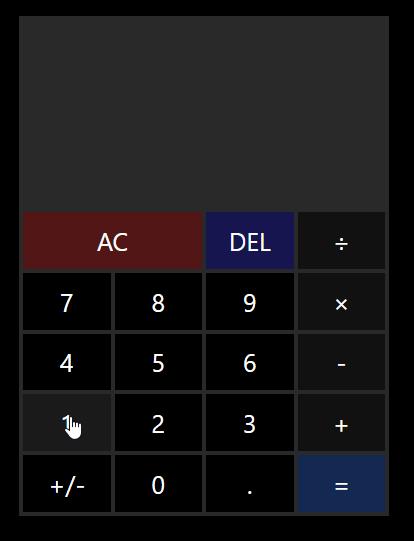

# Browser Calculator

## Overview

A simple in-browser calculator built on JavaScript, HTML, and CSS.

Mouse or keyboard input both work to interact with the calculator, which supports addition, subtraction, multiplication,
and division, and can add periods or change the sign of the current number.

This project was completed as part of [The Odin Project](https://github.com/TheOdinProject/curriculum) curriculum.

## Usage

This project is hosted on **GitHub Pages** and can be accessed [here](https://willkip.github.io/browser-calculator/).

Division by zero will result in an error, and will reset the calculator to its initial state.

## Summary

This project was tricky to complete, as it had edge cases that were not easily detectable. It required thought on what
is intuitive to the end user, and what makes logical sense in the code; hopefully it has struck a sufficient balance.

- I used JavaScript global variables and functions to organize my code and promote reuse.
- I used both CSS Grid and CSS Flexbox where appropriate to position and size elements.
- I used CSS variables to great effect in styling buttons on interaction.
    - I used an event listener to provide visual feedback when a button is pressed, both from mouse and keyboard input.
      This visual feedback was largely automated with CSS.

### Improvement

- Currently, the UI is designed in a dark/night theming. A toggle to switch the site's colour scheme between a lighter
  mode and back would be interesting, and practical.
- The buttons are not selectable with the TAB key or similar. This is a good potential accessibility feature.

## Acknowledgements

The calculator design takes inspiration from Microsoft's Windows Calculator.

## License

This project is licensed under [MIT](https://choosealicense.com/licenses/mit/).